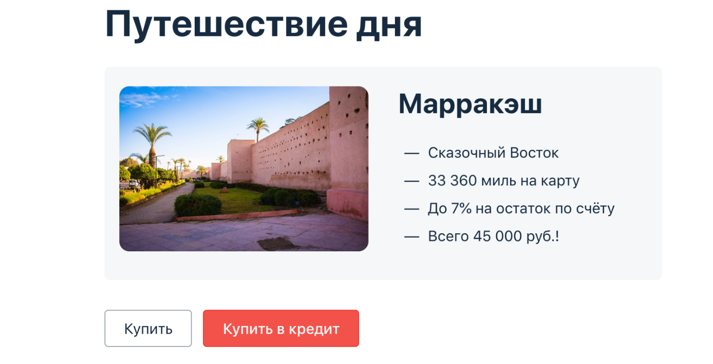

# **Дипломная работа профессии «Тестировщик ПО»**
************
Дипломный проект — автоматизация тестирования комплексного сервиса, взаимодействующего с СУБД и API Банка.

Приложение — это веб-сервис, который предлагает купить тур по определённой цене двумя способами:
1. Обычная оплата по дебетовой карте.
2. Уникальная технология: выдача кредита по данным банковской карты.

Само приложение не обрабатывает данные по картам, а пересылает их банковским сервисам:
* сервису платежей, далее Payment Gate;
* кредитному сервису, далее Credit Gate.

Приложение в собственной СУБД должно сохранять информацию о том, успешно ли был совершён платёж и каким способом. 
Данные карт при этом сохранять не допускается.

## Тестовая документация
**************
+ [План тестирования](docs/Plan.md)
+ [Отчет по итогам тестирования](docs/Report.md)
+ [Отчет по итогам автоматизации](docs/Summary.md)
*************
## Запуск авто-тестов:
На локальном компьютере заранее должны быть установлены **IntelliJ IDEA**, **Docker Desktop**, **Dbeaver**

**1.** Клонировать на локальный компьютер [Дипломный проект](https://github.com/Juliyap2887/Diplom)

**2.** Открыть проект в IntelliJ IDEA

**3.** Запустить Docker Desktop

**4.** В терминале запустить контейнеры:

     docker-compose up -d

**5.** Запустить целевое приложение:

     для mySQL:
     java "-Dspring.datasource.url=jdbc:mysql://localhost:3306/app" -jar artifacts/aqa-shop.jar

     для postgresgl:
     java "-Dspring.datasource.url=jdbc:postgresql://localhost:5432/app" -jar artifacts/aqa-shop.jar

**6.** Проверить доступность приложения в браузере по адресу: http://localhost:8080/

**7.** Открыть второй терминал. Запустить тесты:

    для mySQL:
    ./gradlew clean test "-Ddb.url=jdbc:mysql://localhost:3306/app"

    для postgresgl: 
    ./gradlew clean test "-Ddb.url=jdbc:postgresql://localhost:5432/app"

**8.** Создать отчёт Allure и открыть в браузере:

      ./gradlew allureReport

      ./gradlew allureServe

**9.** Для остановки приложений использовать команду:

       Ctrl+C

**10.** Для удаления контейнеров использовать команду:

       docker-compose down